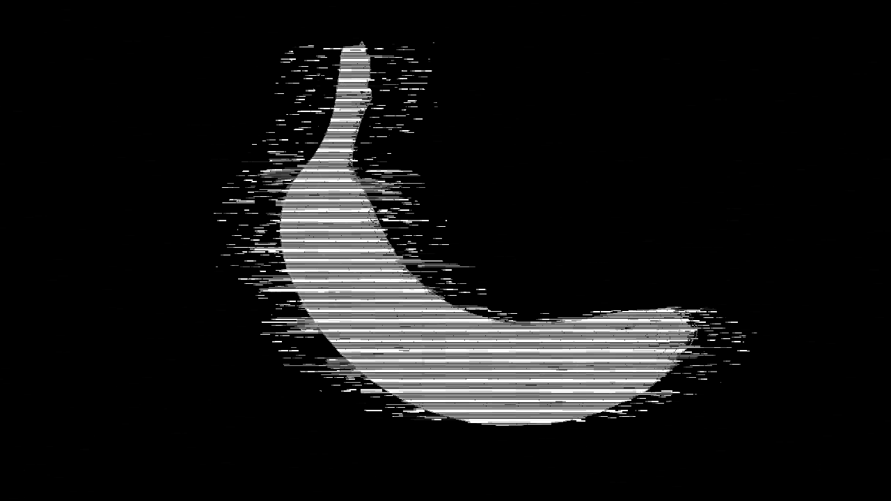

# Glitch Line Filter

English | [中文](./README.zh-CN.md)

`glitch_line_filter.tox` is a TouchDesigner GLSL TOP component that converts an incoming image or video into broken horizontal sketch lines on a black background. It is designed for monochrome scanlines, technical drawing, photocopy, and RGB ghost glitch looks.



Author: `uinipan`

## Compatibility

Tested with TouchDesigner 2023.11280 on Windows.

## Installation

1. Drag `glitch_line_filter.tox` into a TouchDesigner project.
2. Connect an image, Movie File In TOP, or another TOP to its input.
3. Use the component output as the processed TOP.
4. Adjust the `Glitch Line`, `Portrait Lines`, and `Bar Only` parameter pages.

```text
Image or video TOP -> glitch_line_filter -> processed TOP
```

The component has one TOP input and one TOP output. Its output follows the input resolution and uses an 8-bit RGBA pixel format.

## Quick start

1. Select a `Preset`, then pulse `Apply Preset`.
2. Use `Amount` for the overall effect strength.
3. Use `Threshold` and `Fill Gain` to control how much of the subject remains visible.
4. Shape the marks with `Line Density`, `Stroke Width`, `Dash Length`, and `Dash Roughness`.
5. Add motion and breakup with `Jitter`, `Blocks`, `Scan Break`, `Noise`, and `Flicker`.

## Presets

| Preset | Character |
| --- | --- |
| `White Line Glitch` | Balanced monochrome broken-line look. |
| `Hard Scanline` | Denser and harder horizontal scanning. |
| `Broken Xerox` | Rough photocopy-like fragmentation. |
| `Fine Technical` | Cleaner, thinner technical drawing lines. |
| `Ghost RGB` | White-line base with subtle RGB separation. |

Selecting a preset does not immediately change the parameters. Pulse `Apply Preset` after choosing it.

## Glitch Line controls

| Parameter | Function |
| --- | --- |
| `Amount` | Overall strength of the effect. |
| `Edge Gain` | Emphasizes detected edges. High values produce a harder outline. |
| `Threshold` | Controls which image values remain in the line mask. Lower values retain more of the subject. |
| `Line Thickness` | Adjusts the general thickness of the generated line treatment. |
| `Glow` | Adds brightness and spread around white marks. |
| `Jitter` | Adds irregular horizontal movement. |
| `Blocks` | Introduces block-shaped breakup. |
| `Scan Break` | Breaks continuity between scanline regions. |
| `Noise` | Adds fine random disturbance. |
| `Flicker` | Controls animated brightness instability. |
| `RGB Ghost` | Adds RGB channel separation. |
| `Invert Source` | Blends toward an inverted source interpretation. |

These controls normally map to 0-1 in the UI, but they are not clamped. Some bundled presets use values above 1 for `Edge Gain` or `Line Thickness`.

## Portrait Lines controls

| Parameter | Suggested range | Function |
| --- | ---: | --- |
| `Fill Gain` | 0-2+ | Raises the visible mass inside the subject. Increase it when only the outline remains. |
| `Line Density` | 0-1000 | Controls the number and spacing of horizontal rows. |
| `Dash Length` | 0-1 | Controls the length of individual line segments. |
| `Dash Roughness` | 0-1 | Adds irregular breakup to the dashes. |
| `Face Softness` | 0-1 | Softens the subject mask, especially useful for portraits. |
| `Stroke Width` | 0-1 | Controls the thickness of each horizontal stroke. |

## Bar Only control

| Parameter | Range | Function |
| --- | ---: | --- |
| `Base Visibility` | 0-1 | Controls the visibility of the base horizontal-bar layer. |

## Debug views

`Debug Mode` can display intermediate shader stages:

- `Final`: finished output.
- `Edge`: detected edge information.
- `Mask`: subject and line mask.
- `UV`: displacement coordinates used by the shader.

Return to `Final` for normal output.

## Troubleshooting

| Problem | Adjustment |
| --- | --- |
| Subject is almost invisible | Lower `Threshold` or raise `Fill Gain`. |
| Image looks like a harsh outline | Lower `Edge Gain` and `Glow`; raise `Face Softness`. |
| Lines are too dense | Lower `Line Density` or readjust `Stroke Width`. |
| Effect is too chaotic | Lower `Jitter`, `Blocks`, `Scan Break`, and `Flicker`. |
| Need a clean monochrome result | Start with `Fine Technical` or `White Line Glitch`, and keep `RGB Ghost` at 0. |
| Output shows an analysis image | Set `Debug Mode` back to `Final`. |

## Technical notes

- One TOP input and one TOP output.
- GLSL-based processing.
- Input resolution is preserved by the output.
- Five bundled presets.
- Built-in Edge, Mask, and UV debug views.

