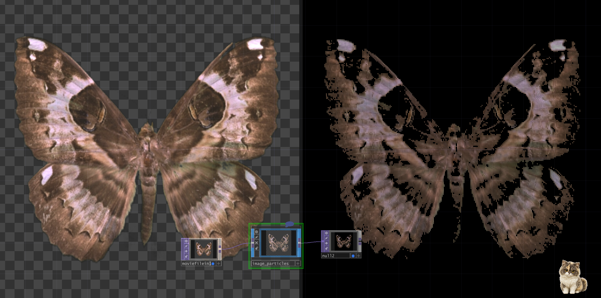

# Image Particles 图片粒子插件

[English](./README.md) | 中文

`image_particles.tox` 用于将图片、视频或其他 TOP 转换为保留原图颜色和宽高比的动态粒子效果。



作者：`uinipan`

## 兼容性

已在 Windows、TouchDesigner 2023.11280 中测试。

## 安装与连接

1. 将 `image_particles.tox` 拖入 TouchDesigner 工程。
2. 把图片、Movie File In TOP 或其他 TOP 接到插件输入。
3. 从插件输出获取粒子 TOP。
4. 打开 `Image Particles` 参数页调节效果。

```text
图片或视频 TOP -> image_particles -> 粒子 TOP 输出
```

输出带透明背景，方便继续合成。

## 快速调节

1. 用 `Brightness Threshold` 确定哪些区域生成粒子。
2. 用 `Point Size` 调整粒子粗细。
3. 用 `Image Depth` 增加前后层次。
4. 用 `Noise Amount` 和 `Noise Speed` 增加运动。
5. 用 `Image Scale` 调整主体在画面中的占比。
6. 用 `Max Render Resolution` 设置最终像素尺寸。

## 参数说明

| 参数 | 范围 | 功能 |
| --- | ---: | --- |
| `Brightness Threshold` | 0–1 | 根据亮度筛选源图像素。数值越高，暗部粒子越少。 |
| `Point Size` | 0.005–0.2 | 控制单个粒子的渲染大小。 |
| `Image Depth` | 0–5 | 增加粒子的前后立体层次。设为 0 时接近平面。 |
| `Noise Amount` | 0–2 | 控制粒子扰动幅度。 |
| `Noise Speed` | -3–3 | 控制扰动动画速度；负值可反向运动。 |
| `Image Scale` | 0.25–4 | 控制粒子图像在画面中的占比。 |
| `Max Render Resolution` | 256–4096 | 设置最终输出的最长边像素。 |
| `Actual Render Resolution` | 只读 | 显示当前计算出的实际宽度和高度。 |

## 输入比例与输出分辨率

`Max Render Resolution` 控制最长边，而不是强制固定宽高：

- 横图：宽度使用设定值，高度按输入比例计算；
- 竖图：高度使用设定值，宽度按输入比例计算；
- 方图：宽高相同。

输入 `2080 × 3120` 的竖图时：

- 设置 2048，实际输出约为 `1365 × 2048`；
- 设置 4096，实际输出约为 `2731 × 4096`。

`Image Scale` 用于构图，`Max Render Resolution` 用于清晰度和性能。不要使用输出分辨率改变主体在画面中的大小。

## 性能建议

- 日常预览建议使用 1280 或 1920；
- 需要高分辨率输出时再提高到 2048 或 4096；
- 运行较卡时，优先降低 `Max Render Resolution`；
- 提高渲染分辨率会增加最终像素，但不会增加粒子采样密度。

## 常见问题

| 问题 | 调整方法 |
| --- | --- |
| 粒子太少或主体缺失 | 降低 `Brightness Threshold`。 |
| 粒子连成一片 | 减小 `Point Size`。 |
| 画面没有立体感 | 提高 `Image Depth`。 |
| 粒子运动太乱 | 降低 `Noise Amount` 或 `Noise Speed`。 |
| 主体太大或太小 | 调节 `Image Scale`。 |
| 输出画面较糊 | 提高 `Max Render Resolution`。 |
| 高分辨率下运行较卡 | 降低 `Max Render Resolution`。 |

## 已知提示

内部 `image_points` Script SOP 可能显示 cook dependency loop 黄色提示。当前打包版本已测试，视觉结果和输出正常。
