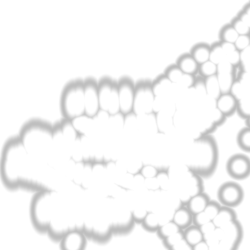

# Mouse Reveal Feedback 鼠标反馈揭示插件

[English](./README.md) | 中文

`mouse_reveal_feedback.tox` 是一个使用鼠标绘制反馈遮罩的 TouchDesigner TOP 插件。鼠标经过的位置可以显示或隐藏输入图像，绘制结果既可以永久保留，也可以随时间逐渐消退。

适合制作交互揭示、鼠标擦除、拖尾、局部显影和实时视觉转场。


上图使用已经经过故障滤镜处理的画面作为输入。插件本身可以接收任意 TOP。

作者：`uinipan`

## 兼容性

已在 Windows、TouchDesigner 2023.11280 中测试。

## 安装与连接

1. 将 `mouse_reveal_feedback.tox` 拖入 TouchDesigner 工程。
2. 把图片、Movie File In TOP 或其他 TOP 接到插件左侧输入。
3. 移动鼠标，在反馈遮罩中绘制轨迹。
4. 从插件右侧获取揭示或擦除后的 TOP 输出。
5. 打开 `Reveal` 参数页调节效果。

```text
图片或视频 TOP -> mouse_reveal_feedback -> 遮罩处理后的 TOP
```

插件为单 TOP 输入、单 TOP 输出。遮罩和输出分辨率都会自动跟随输入 TOP。

## 参数说明

| 参数 | 面板范围 | 功能 |
| --- | ---: | --- |
| `Reset Mask` | Pulse | 清空已经累计的反馈遮罩。 |
| `Brush Size` | 0–0.1 | 调节鼠标圆形笔刷的半径。 |
| `Brush Softness` | 0–0.2 | 软化每次绘制的笔刷边缘。 |
| `Hold` | 0–1 | 控制已绘制区域的保留程度。设为 1 时永久保留；降低后逐渐消退。 |
| `Mask Softness` | 0–1 | 调节累计遮罩整体的柔和程度和响应曲线。 |
| `Mask Gain` | 0–1 | 在合成前放大遮罩强度。 |
| `Reveal Mode` | On/Off | On 显示鼠标画过的区域；Off 显示反向遮罩，隐藏鼠标画过的区域。 |

数值参数没有强制 Clamp，但表中范围是插件面板的预期调节范围。

## 常用设置

### 永久揭示

- 将 `Reveal Mode` 设为 On；
- 将 `Hold` 设为 1；
- 移动鼠标绘制；
- 需要重新开始时点击 `Reset Mask`。

### 自动消退拖尾

- 将 `Reveal Mode` 设为 On；
- 把 `Hold` 降到 1 以下；
- 数值越低，轨迹消退越快。

### 鼠标擦除

- 将 `Reveal Mode` 设为 Off；
- 鼠标画过的位置会被隐藏；
- 使用 `Hold` 决定擦除痕迹永久保留还是逐渐恢复。

## 遮罩调试

插件内部的 `OUT_mask` TOP 用于查看累计反馈遮罩。



- 白色区域：鼠标已经绘制的区域；
- 黑色区域：尚未绘制的区域；
- 灰色软边：由 `Brush Softness` 和 `Mask Softness` 产生。

## 常见问题

| 问题 | 调整方法 |
| --- | --- |
| 画过的位置很快消失 | 提高 `Hold`；永久保留时设为 1。 |
| 轨迹一直不消退 | 把 `Hold` 降到 1 以下。 |
| 笔刷太大或太小 | 调节 `Brush Size`。 |
| 笔刷边缘太硬 | 提高 `Brush Softness` 或 `Mask Softness`。 |
| 揭示效果太弱 | 提高 `Mask Gain`。 |
| 显示了遮罩的另一侧 | 切换 `Reveal Mode`。 |
| 想清空所有绘制 | 点击 `Reset Mask`。 |

## 技术信息

- 单 TOP 输入、单 TOP 输出；
- 分辨率跟随输入，没有固定分辨率依赖；
- Mouse In CHOP 驱动 Circle TOP 笔刷；
- Feedback TOP 保存上一帧遮罩；
- Composite TOP 使用 Maximum 累计新笔刷；
- GLSL TOP 将输入画面与遮罩合成；
- 已检查所有内部节点，无错误或警告。

