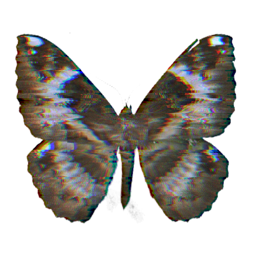

# Reality Glitch Filter

English | [中文](./README.zh-CN.md)

`reality_glitch_filter.tox` is a real-time TouchDesigner GLSL TOP effect for cyberpunk-style image corruption. It combines RGB separation, scanline distortion, horizontal jitter, block displacement, analog noise, posterization, and color grading in one reusable component.



Author: `uinipan`

## Compatibility

Tested with TouchDesigner 2023.11280 on Windows.

## Installation

1. Drag `reality_glitch_filter.tox` into a TouchDesigner project.
2. Connect an image, Movie File In TOP, or another color TOP to its input.
3. Use the component output as the processed TOP.
4. Select a preset, pulse `Apply Preset`, then fine-tune the controls.

```text
Image or video TOP -> reality_glitch_filter -> glitch TOP output
```

The component has one TOP input and one TOP output. Its resolution follows the input TOP.

## Presets

| Preset | Character |
| --- | --- |
| `Cyberpunk` | Balanced RGB split, scanline, jitter, block, and cyan tint treatment. |
| `Analog Noise` | Stronger grain, scanlines, and analog texture. |
| `RGB Split` | Emphasizes chromatic channel separation with lighter distortion. |
| `Scanline Jitter` | Dense scanlines and aggressive horizontal line displacement. |
| `Tile Jitter` | Strong block/tile displacement and fragmented motion. |
| `Datamosh Lite` | Blocky compression-like motion with posterization and green tint. |

Selecting a preset does not immediately change the parameters. Pulse `Apply Preset` after choosing it.

## Controls

| Parameter | Function |
| --- | --- |
| `Amount` | Overall effect strength and blend influence. |
| `Speed` | Animation speed for jitter, noise, blocks, and scanlines. |
| `RGB Split` | Horizontal separation between red, green, and blue samples. |
| `Scanlines` | Strength of animated horizontal scanline modulation. |
| `Jitter` | Density and distance of horizontal line displacement. |
| `Blocks` | Amount of block/tile displacement. |
| `Noise` | Strength of fine analog grain and cloudy noise. |
| `Posterize` | Reduces the number of color levels. |
| `Brightness` | Adds or subtracts overall brightness. |
| `Contrast` | Expands or compresses contrast around mid-gray. |
| `Tint` | RGB multiplier used for color grading. |

Most controls use a 0-1 UI range, but they are not hard-clamped. Bundled presets may use `Speed` and `Contrast` above 1 or a small negative `Brightness` value.

## Debug views

`Debug Mode` exposes intermediate shader data:

- `Final`: finished effect.
- `UV`: displaced sampling coordinates.
- `Noise`: animated procedural noise.
- `Mask`: combined line, block, and tile activation mask.

Return to `Final` for normal output.

## Quick recipes

### Clean RGB offset

- Start with `RGB Split`.
- Lower `Noise`, `Blocks`, and `Scanlines`.
- Adjust `RGB Split` and `Amount`.

### Analog monitor

- Start with `Analog Noise`.
- Raise `Scanlines` and `Noise`.
- Keep `RGB Split` subtle.

### Hard digital breakup

- Start with `Tile Jitter` or `Datamosh Lite`.
- Raise `Blocks`, `Jitter`, and `Posterize`.
- Use `Speed` to control motion intensity.

## Troubleshooting

| Problem | Adjustment |
| --- | --- |
| Effect is too chaotic | Lower `Amount`, `Jitter`, and `Blocks`. |
| Colors separate too far | Lower `RGB Split`. |
| Image is too noisy | Lower `Noise` and `Scanlines`. |
| Motion is too fast | Lower `Speed`. |
| Image becomes too dark or bright | Reset `Brightness`, then adjust `Contrast`. |
| Output shows UV/noise/mask data | Set `Debug Mode` to `Final`. |

## Technical notes

- One TOP input and one TOP output.
- GLSL TOP processing with input-driven resolution.
- Procedural hash/noise functions; no external texture dependency.
- Built-in preset table and debug views.
- Shader compiled successfully and all internal operators were checked with no errors or warnings.

## Inspiration and implementation

The effect categories were inspired by [XanderXu/RealityGlitchArt](https://github.com/XanderXu/RealityGlitchArt), a Shader Graph example project for Reality Composer Pro / visionOS. This component is an independent TouchDesigner GLSL TOP rewrite for 2D image processing; it does not require RealityKit, Reality Composer Pro, or Apple platforms.

