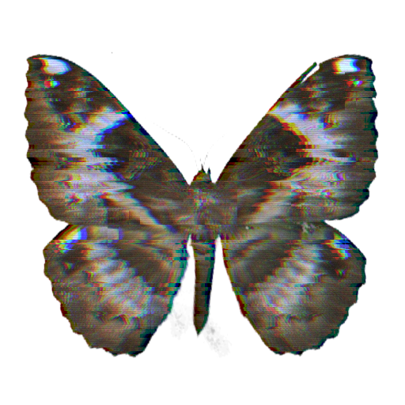

# Reality Glitch Filter 现实故障滤镜

[English](./README.md) | 中文

## 插件功能

`reality_glitch_filter.tox` 是一个实时 TouchDesigner GLSL TOP 赛博朋克风格图像故障效果组件，集 RGB 分离、逐通道 RGB 偏移/缩放调节、扫描线扭曲、水平抖动、块状位移、模拟噪点、色调分离和调色于一体。



作者：`uinipan`

已在 TouchDesigner 2023.11280 / Windows 中测试。

## 安装与连接

1. 将 `reality_glitch_filter.tox` 拖入 TouchDesigner 工程。
2. 把图片、Movie File In TOP 或其他彩色 TOP 接到插件输入。
3. 从插件输出获取处理后的 TOP。
4. 选择预设，点击 `Apply Preset`，再微调参数。

```text
图片或视频 TOP -> reality_glitch_filter -> 故障效果输出
```

插件为单 TOP 输入、单 TOP 输出，分辨率跟随输入。

## 预设说明

| 预设 | 视觉特点 |
| --- | --- |
| `Cyberpunk` | 均衡的 RGB 分离、扫描线、抖动、块状位移和青色色调。 |
| `Analog_Noise` | 更强的颗粒、扫描线和模拟质感，偏暖色调。 |
| `RGB_Split` | 强调色彩通道分离，扭曲较轻，偏粉色调。 |
| `Scanline_Jitter` | 密集扫描线和激烈的水平行位移。 |
| `Tile_Jitter` | 强块状/瓦片位移和碎片化运动，偏暖黄色调。 |
| `Datamosh_Lite` | 块状压缩失真风格运动，带色调分离和绿色调。 |

只选择预设不会立即改动参数，选择后需要点击一次 `Apply Preset`。

应用预设会设置所有主效果参数和 `Tint` 三通道，并**把 `RGB Adjust` 页重置为中性**（偏移为 `0`、缩放为 `1`）。在 `RGB Adjust` 页手动调的内容会在每次应用预设时被覆盖——请先选预设，再做逐通道微调。

## Reality Glitch 参数

| 参数 | 功能 |
| --- | --- |
| `Preset` | 预设选择器。选择后需点击 `Apply Preset` 生效。 |
| `Apply Preset` | 应用选中的预设到所有效果参数，并将 `RGB Adjust` 重置为中性。 |
| `Amount` | 整体效果强度和混合程度。 |
| `Speed` | 抖动、噪点、块位移和扫描线的动画速度。 |
| `RGB Split` | 红、绿、蓝采样的全局水平分离量。 |
| `Scanlines` | 动态水平扫描线调制强度。 |
| `Jitter` | 水平行位移的密度和距离。 |
| `Blocks` | 块状/瓦片位移程度。 |
| `Noise` | 细腻模拟颗粒和云雾噪点强度。 |
| `Posterize` | 减少色彩层级数量。 |
| `Brightness` | 整体提亮或压暗。 |
| `Contrast` | 以中灰为中心扩展或压缩对比度。 |
| `Tint`（共 3 个） | 三个独立通道乘数——红、绿、蓝——用于调色。Cyberpunk 的 `(0.10, 0.78, 1.00)` 即标志性青色效果。 |
| `Debug Mode` | 切换输出到着色器中间数据（`final` / `uv` / `noise` / `mask`）。正常输出用 `final`。 |
| `Author` | 只读作者信息。 |

大部分参数的面板常用范围为 0–1，但没有强制 Clamp；内置预设可能会使用大于 1 的 `Speed`、`Contrast` 或小的负值 `Brightness`。

## RGB Adjust 参数

在全局 `RGB Split` 之上叠加的逐通道几何偏移。可以用来做非对称、手工调校的色差效果——例如只让红色通道横向偏移并放大。

| 参数 | 功能 |
| --- | --- |
| `Red Horizontal` / `Red Vertical` | 红色通道水平 / 垂直偏移（UV 单位，如 `0.04` = 画面宽度的 4%）。 |
| `Red Scale` | 以画面中心为中心缩放红色通道。大于 `1` 为放大。 |
| `Green Horizontal` / `Green Vertical` / `Green Scale` | 绿色通道同上。 |
| `Blue Horizontal` / `Blue Vertical` / `Blue Scale` | 蓝色通道同上。 |

中性状态为所有偏移 `0`、所有缩放 `1`。预设会将本页重置为中性，所以请先应用预设，再手动调整通道。

## 调试视图

`Debug Mode` 用于查看着色器中间结果：

- `final`：最终效果；
- `uv`：位移后的采样坐标；
- `noise`：动态程序化噪点；
- `mask`：行、块、瓦片激活遮罩的合成结果。

正常输出时应切回 `final`。

## 快速配方

### 干净的 RGB 错位

- 从 `RGB_Split` 预设开始。
- 调低 `Noise`、`Blocks` 和 `Scanlines`。
- 调整 `RGB Split` 和 `Amount`。
- 想要非对称分离时，保持 `RGB Split` 较低，改在 `RGB Adjust` 页只偏移单个通道。

### 模拟监视器

- 从 `Analog_Noise` 预设开始。
- 提高 `Scanlines` 和 `Noise`。
- `RGB Split` 保持轻微。

### 硬数字破碎

- 从 `Tile_Jitter` 或 `Datamosh_Lite` 预设开始。
- 提高 `Blocks`、`Jitter` 和 `Posterize`。
- 用 `Speed` 控制运动强度。

## 常见问题

| 问题 | 调整方法 |
| --- | --- |
| 效果过于混乱 | 降低 `Amount`、`Jitter` 和 `Blocks`。 |
| 颜色分离太远 | 降低 `RGB Split`，并检查 `RGB Adjust` 页是否有残留的通道偏移。 |
| 单个颜色通道错位或被缩放 | 重置 `RGB Adjust` 页：偏移归 `0`，缩放归 `1`。 |
| 画面噪点太多 | 降低 `Noise` 和 `Scanlines`。 |
| 运动太快 | 降低 `Speed`。 |
| 画面过暗或过亮 | 先复位 `Brightness`，再调整 `Contrast`。 |
| 输出显示 UV/噪点/遮罩图 | 把 `Debug Mode` 切回 `final`。 |
| 手动调的 RGB Adjust 消失了 | 应用预设会重置该页，属于设计行为——请在预设之后重新调整通道偏移。 |

## 技术信息

- 单 TOP 输入、单 TOP 输出。
- GLSL TOP 处理，分辨率跟随输入。
- 程序化 hash/噪点函数，无外部贴图依赖。
- 预置存放在内部 CSV 表中，通过 `Apply Preset` 脉冲应用。
- 内置调试视图（`final` / `uv` / `noise` / `mask`）。

## 灵感与实现

效果类别受 [XanderXu/RealityGlitchArt](https://github.com/XanderXu/RealityGlitchArt)（Reality Composer Pro / visionOS 的 Shader Graph 示例项目）启发。本组件是面向 2D 图像处理的独立 TouchDesigner GLSL TOP 重写，不依赖 RealityKit、Reality Composer Pro 或 Apple 平台。
