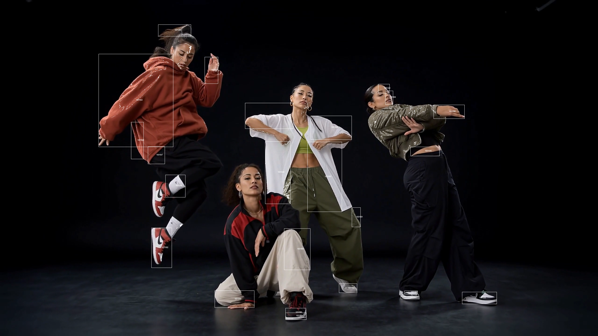

# Square Tracker 方块追踪

[English](./README.md) | 中文

`square_tracker.tox` 是一个可复用的 TouchDesigner TOP 组件，基于 Blob Track 追踪流程。它会将图像或视频里的高对比区域转换为被追踪的方块，并叠加反馈、位移、标题和独立颜色控制。



作者：`uinipan`

## 兼容性

已在 Windows 的 TouchDesigner 2023.11280 中测试。

## 安装与连接

1. 将 `square_tracker.tox` 拖入 TouchDesigner 工程。
2. 将图片、Movie File In TOP、相机 TOP 或任意 TOP 接入插件输入端。
3. 从插件输出端取得处理后的 TOP。
4. 在 `Tracking`、`Visual`、`Motion` 参数页调节效果。

```text
图片或视频 TOP -> square_tracker -> 方块追踪效果 TOP
```

插件为单 TOP 输入、单 TOP 输出，输出分辨率会自动跟随输入 TOP。

## 参数说明

### Tracking

| 参数 | 功能 |
| --- | --- |
| `Threshold` | 用于识别追踪区域的亮度阈值。 |
| `Min Blob Size` | 过滤过小的噪点区域。 |
| `Max Blob Size` | 过滤过大的区域。 |
| `Max Move Distance` | 保持同一追踪 ID 时允许的最大帧间移动距离。 |
| `Revive Time` | Blob 丢失后仍可恢复原 ID 的时间。 |

### Visual

| 参数 | 功能 |
| --- | --- |
| `Trail Opacity` | 控制反馈残影的保留程度。 |
| `Track Color` | Blob Track 描边的颜色。 |
| `Square Material Color` | 渲染方块的材质颜色。 |
| `Title` | 最终合成画面中叠加的文字。 |
| `Title Text Color` | 标题文字颜色。 |

### Motion

| 参数 | 功能 |
| --- | --- |
| `Noise Warp` | 输入侧位移强度。 |
| `Feedback Warp` | 反馈位移强度。 |
| `Grow / Shrink` | 控制最终画面的放大或收缩。 |

## 快速调节

1. 从 `Threshold = 0.2` 左右开始。
2. 噪点太多时，提高 `Min Blob Size`。
3. 主体跟不上时，降低 `Threshold` 或提高 `Max Move Distance`。
4. 用 `Trail Opacity` 与 `Feedback Warp` 平衡残影与运动感。
5. 分别设置三组色块：追踪描边、方块材质和标题文字。

## 常见问题

| 问题 | 调整方式 |
| --- | --- |
| 追踪到太多小块 | 提高 `Min Blob Size` 或 `Threshold`。 |
| 主体没有被追踪 | 降低 `Threshold` 或提高 `Max Blob Size`。 |
| ID 很快跳变 | 提高 `Max Move Distance` 或 `Revive Time`。 |
| 反馈画面太混乱 | 降低 `Feedback Warp` 或 `Trail Opacity`。 |
| 输出尺寸没有跟随素材 | 确认 TOP 接在插件输入端；输出会自动跟随。 |

## 技术说明

- 单 TOP 输入、单 TOP 输出。
- 输出分辨率自动跟随输入分辨率。
- 使用 TouchDesigner Blob Track、实例化几何、Render TOP 与反馈处理构成。
- 内部网络保留，可用于学习和二次修改。
