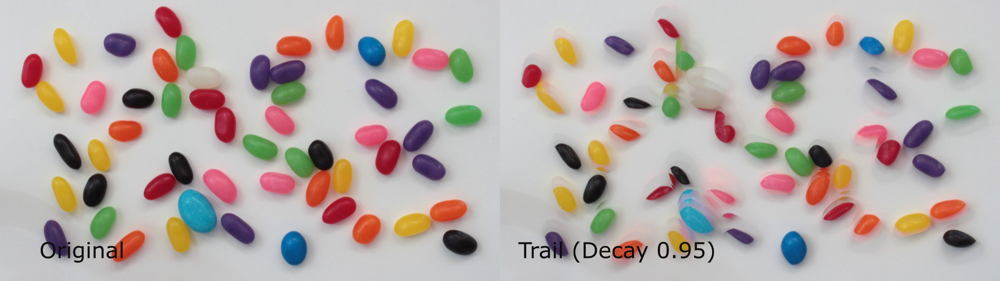

# Video Trail 视频拖尾

[English](./README.md) | 中文

## 插件功能

`video_trail.tox` 是一个轻量 TouchDesigner 组件，为任意图片或视频 TOP 添加逐渐淡出的运动拖尾。亮部会残留并随时间平滑衰减——经典的光轨 / 运动残影效果。



*左：原始输入画面。右：`Trail Decay` 为 0.95 时的拖尾效果。*

作者：`uinipan`

已在 TouchDesigner 2023.11280 / Windows 中测试。

## 包内容

- `video_trail.tox` — TouchDesigner 组件
- `README.md` — 英文文档
- `README.zh-CN.md` — 中文说明

## 安装与连接

1. 将 `video_trail.tox` 拖入 TouchDesigner 工程。
2. 把任意 TOP（图片、Movie File In、渲染输出、摄像头）接到插件输入。
3. 从插件输出获取带拖尾的画面。

```text
图片或视频 TOP -> video_trail -> 拖尾效果输出
```

单 TOP 输入、单 TOP 输出，输出分辨率跟随输入。

## 工作原理

每一帧，内部缓存先乘以 `Trail Decay`，再与当前帧做逐像素取最大值：

```text
trail = max(trail * Decay, 当前帧)
```

新的亮部立即出现，旧画面按指数衰减。因此**暗背景上的亮内容**（灯光、火花、剪影、黑底白色图形）拖尾效果最明显。

## Trail 参数

| 参数 | 范围 | 功能 |
| --- | --- | --- |
| `Trail Decay` | 0–1 | 每帧拖尾保留比例。越大拖尾越长：`0.9` = 每帧衰减 10%；`1.0` = 永不消失（永久最大值保持）；`0` = 关闭效果（直接透传当前帧）。 |

衰减是按帧计算的，所以拖尾的实际秒数取决于工程帧率：60 fps 下 `0.9` 约可见三分之一秒，`0.95` 约三分之二秒。

## 常见问题

| 问题 | 原因 / 解决 |
| --- | --- |
| 看不到拖尾 | 输入画面太暗或对比度低。拖尾在"亮主体 + 暗背景"上最明显。 |
| 画面慢慢积成全白 | `Trail Decay` 等于或接近 `1.0`，缓存只增不减。调低（建议 `0.85`–`0.95`）。 |
| 拖尾长度不合适 | 调 `Trail Decay`；注意效果按帧计算，工程 fps 变了拖尾时长也会变。 |
| 掉帧 | 处理在 CPU 上逐像素进行（Script TOP + NumPy）。降低输入分辨率可提升性能。 |

## 技术信息

- 单 TOP 输入、单 TOP 输出，分辨率跟随输入。
- 基于 CPU 处理（Script TOP + NumPy 逐像素最大值衰减），不涉及 GPU shader。
- 拖尾长度与工程帧率相关。
- 依赖 NumPy（TouchDesigner 自带）。
